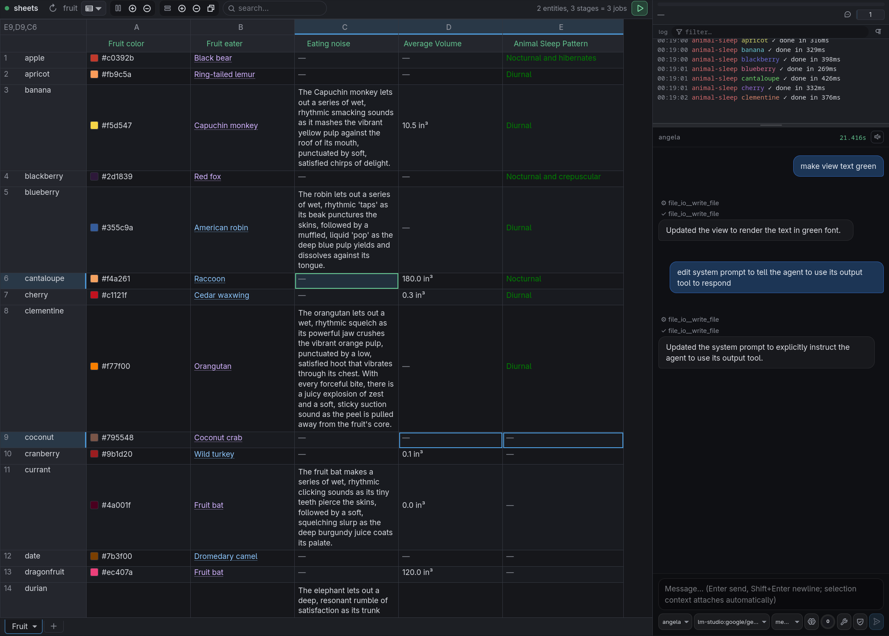

# 👻 sheets

Bulk agentic LLM execution via spreadsheets.

Imagine a spreadsheet where **rows are entities, columns are [pipeline](https://www.github.com/mikesmullin/agent-pipeline) stages, and a Play button runs any
lasso-selected slice of (entity × stage) through a concurrency-controlled queue**. 
It's like a cross between Excel AutoFill and Jupyter notebooks.

Includes built-in agentic assistant chat sidebar that can author the stage scripts from one-sentence prompts.



## Quick start

```sh
bun install       # install deps
bun link          # add `sheets` binary in $PATH
sheets            # print help text
```

### Sample dataset
```sh
cd examples/fruit/
sheets serve      # launch http server
# open browser to http://localhost:4400
```